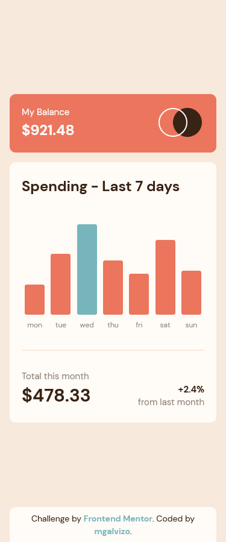
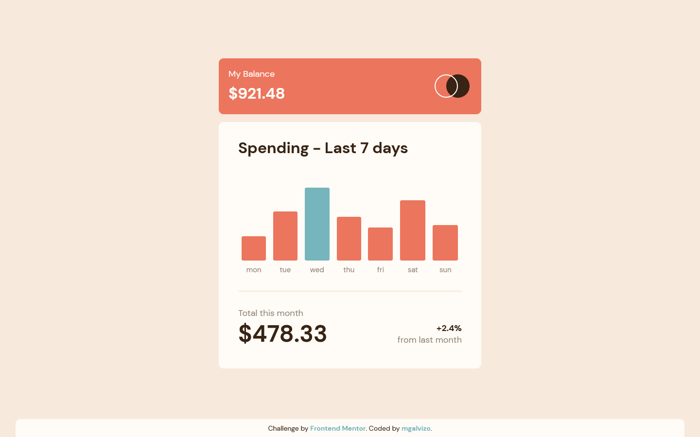

# Frontend Mentor - Expenses chart component solution

This is a solution to the [Expenses chart component challenge on Frontend Mentor](https://www.frontendmentor.io/challenges/expenses-chart-component-e7yJBUdjwt). Frontend Mentor challenges help you improve your coding skills by building realistic projects.

## Table of contents

-   [Overview](#overview)
    -   [The challenge](#the-challenge)
    -   [Screenshot](#screenshot)
    -   [Links](#links)
-   [My process](#my-process)
    -   [Built with](#built-with)
    -   [What I learned](#what-i-learned)
    -   [Useful resources](#useful-resources)
-   [Author](#author)

## Overview

### The challenge

Users should be able to:

-   View the bar chart and hover over the individual bars to see the correct amounts for each day
-   See the current day’s bar highlighted in a different colour to the other bars
-   View the optimal layout for the content depending on their device’s screen size
-   See hover states for all interactive elements on the page
-   Use the JSON data file provided to dynamically size the bars on the chart

### Screenshot

#### Mobile

#### Desktop

### Links

-   [Solution URL](https://www.frontendmentor.io/solutions/expenses-chart-component-with-reactjs-and-styledcomponents-ZLbigTeURH)
-   [Live Site URL](https://mgalvizo.github.io/expenses-chart-component/)

## My process

### Built with

-   Semantic HTML5 markup
-   CSS custom properties
-   Flexbox
-   Grid
-   Mobile-first workflow
-   [React](https://reactjs.org/) - JS library
-   [Styled Components](https://styled-components.com/)

### What I learned

Creating a Global Style for the app.

Implementing individual styled-components that make up the whole app.

Passing and using props in styled-components.

### Useful resources

-   [Styled Components Documentation](https://styled-components.com/docs/basics#getting-started) - This helped me to get started with the implementation of styled-components

## Author

-   Frontend Mentor - [@mgalvizo](https://www.frontendmentor.io/profile/mgalvizo)
